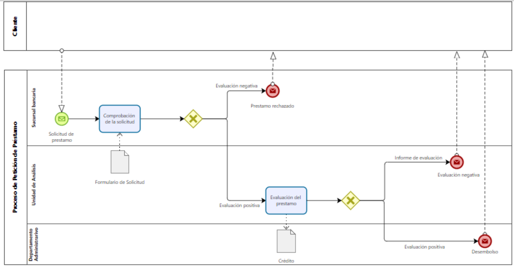

# Sesión 1

## Enunciado

El proceso comienza cuando en la sucursal bancaria se registra una solicitud de préstamo en el sistema. A continuación se realiza la comprobación de la solicitud, como resultado de lo cual, ocurre una de las siguientes opciones: el préstamo se rechaza y se finaliza el proceso; el préstamo pasa a estudio por parte de la unidad de análisis de créditos del banco. En este último caso, si el préstamo es evaluado positivamente se realiza el desembolso del mismo por el departamento administrativo y se finaliza el proceso. En caso de evaluación negativa se informa de la evaluación al cliente y se finaliza el proceso.

## Entrega

[PaulaCastillejoBravo_AMP_P1.bpm](PaulaCastillejoBravo_AMP_P1.bpm).

