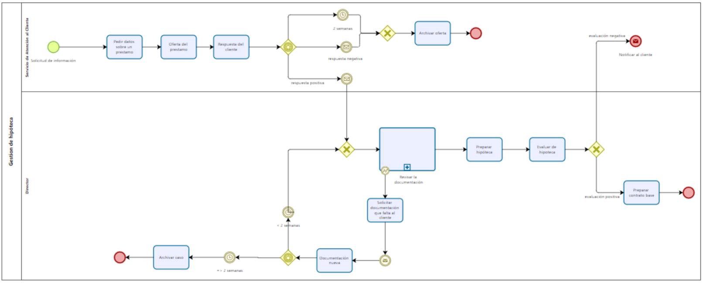

# Sesión 2

## Enunciado

El proceso comienza cuando el cliente solicita información sobre un préstamo al servicio de atención al cliente de su sucursal bancaria, que le envía dicha oferta. En caso de recibirse como respuesta del cliente que no está interesado o transcurridas dos semanas desde el envío de la oferta, se archiva la oferta y finaliza el proceso. En caso de recibirse respuesta positiva por parte del cliente, el director de la sucursal empieza a revisar la documentación. Esta acción implica revisar los documentos y decidir qué hacer en caso de que falten documentos, lo cual es un caso excepcional. En este caso excepcional, se deberá solicitar la documentación que falta al cliente de modo que si se recibe en un plazo inferior a dos semanas se vuelve a revisar la documentación, si no, se archiva el caso y finaliza el proceso. En caso de que tengamos toda la documentación, se prepara la hipoteca y se evalúa: si la evaluación es positiva el director prepara un contrato base y una vez hecho se finaliza el proceso enviando dicho contrato al cliente; si la evaluación es negativa se notifica al cliente y se finaliza el proceso.

## Entrega

[PaulaCastillejoBravo_AMP_P2.bpm](PaulaCastillejoBravo_AMP_P2.bpm).

